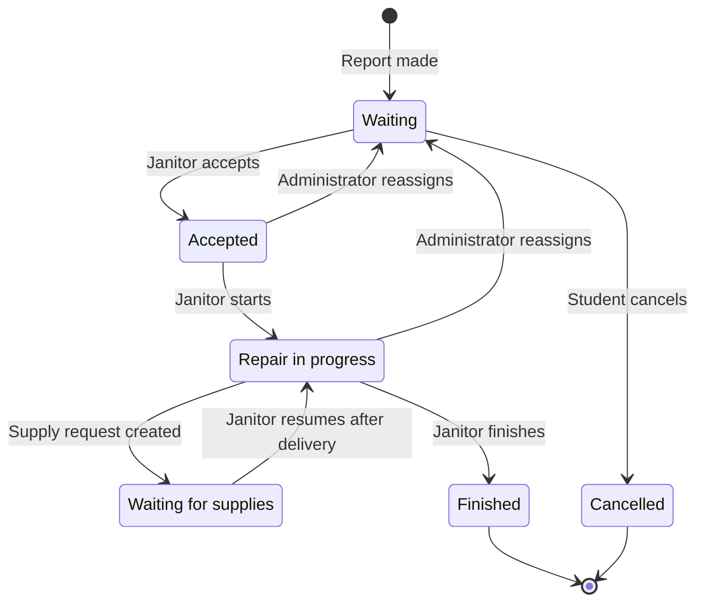

# Student Dormitory Maintenance System — Specification

**Status:** Draft v0.2 · **Stack:** Angular + NgRx, NestJS, Passport.js (JWT), PostgreSQL

## Contents

 [[#1. Purpose and Scope]]
 [[#2. Decisions and Constraints]]
 [[#3. Actors and Roles]]
 [[#4. Functional Requirements]]
 [[#5. Report Lifecycle]]
[[#6. Supply Request Lifecycle]]
[[#7. Priority and Reassignment Rules]]
[[#8. Notifications]]
[[#9. Data Model (initial)]]
[[#10. API Endpoints (REST + real-time)]]
[[#11. Non-Functional Requirements]]
[[#12. Screens (initial)]]
[[#13. Technical Architecture]]
[[#14. Questions and Decisions]]
[[#15. Current Milestones]]

---

## 1. Purpose and Scope

A web application that lets dormitory residents report damage or defects, lets janitors pick up and carry out the repair jobs, and lets the dormitory administration control supplies and staffing priorities.

**In scope:** report lifecycle, job assignment, time estimation, janitor specializations, supply requests, reassignment, notifications.

**Out of scope (v1):**
- payments, billing students for damage, inventory of physical stock
- native mobile apps (the web UI is responsive)
- student confirmation, rating, or reopening of finished repairs (possible later extension, see D11)
- shift or working-hours scheduling

### Glossary

| Term               | Meaning                                                                                                     |
|--------------------|-------------------------------------------------------------------------------------------------------------|
| **Active job**     | A job whose report is in `Accepted` or `Repair in progress`.                                                |
| **Free janitor**   | A janitor with no active job. Jobs in `Waiting for supplies` do not make a janitor busy.                    |
| **Specialization** | A report category (e.g. plumbing, electrical) a janitor is skilled in; it steers which alerts they receive. |

## 2. Decisions and Constraints

| ID  | Decision                                                                                                                                                                                              |
|-----|-------------------------------------------------------------------------------------------------------------------------------------------------------------------------------------------------------|
| D1  | A student belongs to one dormitory and one room. A report is tied to the dormitory, but not necessarily to a room (it may concern a common area, e.g. corridor, bathroom, kitchen, exterior).         |
| D2  | A job is handled by one janitor at a time. A janitor holds at most one active job. While a job is in `Waiting for supplies`, the janitor may take another job (see section [[#5. Report Lifecycle]]). |
| D3  | User creation and role assignment follow industry best practices (see section [[#3.1 User Provisioning and Role Assignment]]).                                                                        |
| D4  | One dormitory per deployment; multi-dormitory support is a later extension. The data model must not block it (see section [[#9. Data Model (initial)]]).                                              |
| D5  | Notifications are in-app and real time (WebSocket). In v1, email is used only for activation and password-reset links (D9); email notifications are planned for later.                                |
| D6  | Stack: Angular SPA with NgRx, NestJS backend, Passport.js with JWT for authentication.                                                                                                                |
| D7  | Janitors have one or more specializations. They decide which new-report alerts a janitor receives (see section [[#8. Notifications]]).                                                                |
| D8  | The student sets the initial severity of a report. Afterwards only the administrator can change it.                                                                                                   |
| D9  | Student email addresses are collected by the administrator with the move-in paperwork and entered into the system (single or CSV import). Activation and reset links are sent to these addresses.     |
| D10 | There are no working hours or shifts; alerts are not limited by time of day.                                                                                                                          |
| D11 | `Finished` is the final state in v1. Students cannot confirm, rate or reopen a finished repair; this may be added later.                                                                              |

## 3. Actors and Roles

| Role                    | Description                                                                       |
| ----------------------- | --------------------------------------------------------------------------------- |
| Student                 | Resident who reports problems and follows their progress                          |
| Janitor                 | Maintenance worker with one or more specializations who accepts and performs jobs |
| Dormitory Administrator | Manages supply procurement, priorities, staffing and janitor specializations      |

Role-based access control (RBAC) is enforced on every endpoint and every UI route.

### 3.1 User Provisioning and Role Assignment

**Account creation**
- No public self-registration. Accounts are created by an administrator, singly or by bulk CSV import (e.g., a student roster built from move-in paperwork).
- Administrator accounts are created only by an existing administrator or by a one-time bootstrap command. A second factor is optional for administrators.

**Onboarding and credentials**
- Onboarding uses a single-use, time-limited activation link sent by email to the address the administrator recorded. The user sets their own password; administrators never see or set passwords.
- Password reset follows the same single-use, expiring email link flow.
- Passwords are hashed with Argon2id (bcrypt as a fallback) and checked against a minimum-length and breached-password policy.
- Login is rate-limited with temporary lockout after repeated failures.

**Roles and access**
- Exactly one role per user, assigned by an administrator. Least privilege: default deny, guards on every route.
- An administrator assigns janitor specializations, at creation or later.

**Audit and retention**
- Role changes, specialization changes, and deactivations are audit-logged (who, when, previous and new value).
- Users are deactivated, never hard-deleted, so history stays intact.

## 4. Functional Requirements

### 4.1 Student

| ID  | Requirement                                                                                                                                                           |
|-----|-----------------------------------------------------------------------------------------------------------------------------------------------------------------------|
| S-1 | Create a report: title, description, category (plumbing, electrical, furniture, heating, other), location (free-form description), optional photos, initial severity. |
| S-2 | View own reports with current status.                                                                                                                                 |
| S-3 | View report details including the status history (timeline).                                                                                                          |
| S-4 | See the assigned janitor's name and the estimated completion time once set.                                                                                           |
| S-5 | Cancel or edit a report (including its initial severity) while it is still in `Waiting`. Afterwards, severity can only be changed by the administrator.               |
| S-6 | Receive a notification on each status change and when the administrator changes the severity.                                                                         |

### 4.2 Janitor

| ID  | Requirement                                                                                                                                                                                           |
|-----|-------------------------------------------------------------------------------------------------------------------------------------------------------------------------------------------------------|
| J-1 | Receive a real-time alert when a new report is submitted in a category matching one of their specializations (reports in category `other` alert all janitors).                                        |
| J-2 | Browse the list of unassigned reports, filterable by category, severity, location type and room. The list shows all unassigned reports, not only those matching specializations.                      |
| J-3 | Accept a report; it becomes assigned to that janitor and leaves the unassigned list for others. Acceptance is race-safe (only one janitor can win) and allowed only if the janitor has no active job. |
| J-4 | Enter a time estimate for the job; may revise it with a reason.                                                                                                                                       |
| J-5 | Change job status: `Repair in progress`, `Finished`. After supplies are delivered, resume the job (`Waiting for supplies` → `Repair in progress`) once no other job of theirs is active.              |
| J-6 | Create a supply request (item, quantity, optional justification) linked to a job when supplies are unavailable; the job moves to `Waiting for supplies`.                                              |
| J-7 | See the status of own supply requests and the expected arrival time.                                                                                                                                  |
| J-8 | Be notified when reassigned to or from a job.                                                                                                                                                         |
| J-9 | While a job is in `Waiting for supplies`, accept and work on another job. Jobs whose supplies have arrived are flagged "ready to resume" in the janitor's job list.                                   |

### 4.3 Dormitory Administrator

| ID  | Requirement                                                                                                                                                                             |
|-----|-----------------------------------------------------------------------------------------------------------------------------------------------------------------------------------------|
| A-1 | View all reports, jobs, janitors (with specializations) and their current workload.                                                                                                     |
| A-2 | Procure the supplies requested by janitors and mark supply requests as ordered or delivered.                                                                                            |
| A-3 | Set the expected supply arrival time.                                                                                                                                                   |
| A-4 | Reassign a janitor from a lower-severity job to a higher-severity one when no janitor is free; the affected job returns to the unassigned list (`Waiting`) and its student is notified. |
| A-5 | Change a report's severity (adjusting the student's initial value if necessary); every change is recorded in the report history.                                                        |
| A-6 | Manage users: create (single/bulk), send activation link, assign role, assign janitor specializations, deactivate, reset access. All actions are audit-logged (see 3.1).                |

## 5. Report Lifecycle

### States

| #   | State                  | Meaning                                          |
| --- | ---------------------- | ------------------------------------------------ |
| 1   | `Waiting`              | Submitted, no janitor assigned                   |
| 2   | `Accepted`             | Janitor assigned, estimate may be set            |
| 3   | `Repair in progress`   | Janitor is working on it                         |
| 4   | `Waiting for supplies` | Blocked on a requested or ordered supply request |
| 5   | `Finished`             | Repair done (final in v1)                        |
| 6   | `Cancelled`            | Cancelled by the student before acceptance       |

### Transitions

| From                                | To                     | Triggered by                                                                           |
| ----------------------------------- | ---------------------- | -------------------------------------------------------------------------------------- |
| `Waiting`                           | `Accepted`             | Janitor accepts                                                                        |
| `Accepted`                          | `Repair in progress`   | Janitor starts                                                                         |
| `Accepted` / `Repair in progress`   | `Waiting for supplies` | Supply request created                                                                 |
| `Waiting for supplies`              | `Repair in progress`   | Janitor resumes after delivery, provided they have no other active job                 |
| `Accepted` / `Repair in progress`   | `Waiting`              | Administrator reassigns the janitor                                                    |
| `Repair in progress`                | `Finished`             | Janitor finishes                                                                       |
| `Waiting`                           | `Cancelled`            | Student cancels                                                                        |

### Rules

- A janitor holds at most one active job (`Accepted` or `Repair in progress`). A job in `Waiting for supplies` is not active, so the janitor may accept another job meanwhile.
- Janitors cannot release a job voluntarily. A job leaves its janitor only when the administrator reassigns the janitor to a higher-severity job (the job returns to `Waiting`) or the job is in `Waiting for supplies` state.
- If supplies arrive while the janitor is busy with another active job, the original job stays in `Waiting for supplies` and unassigned so some other janitor can continue the work, or until the janitor finishes the active job and resumes it.
- Every transition is recorded with an actor, timestamp, and optional comment. Severity changes are recorded as well (see `ReportEvent` in section 9).

## 6. Supply Request Lifecycle

`Requested` → `Ordered` (with expected arrival time) → `Delivered`

The administrator moves a request to `Ordered` and sets the expected arrival time (A-2, A-3), then marks it `Delivered`. Each step notifies the requesting janitor (see section 8).

## 7. Priority and Reassignment Rules

- Severity levels: `Low`, `Medium`, `High`, `Critical` (e.g., flooding, no heating in winter, electrical hazard).
- The student sets the initial severity; only the administrator can change it afterwards.
- Reassignment is offered to the administrator only when a report with higher severity than a janitor's current active job is open and no janitor is free.
- The system suggests the best candidate: lowest-severity current job, the least progress, preferring janitors whose specializations match the category of the higher-severity report.

## 8. Notifications

| Event                               | Recipients                                                                                                         |
| ----------------------------------- | ------------------------------------------------------------------------------------------------------------------ |
| New report submitted                | Janitors whose specializations include the report category (all janitors for `other`); no time-of-day restriction  |
| Report accepted                     | Student                                                                                                            |
| Status changed                      | Student                                                                                                            |
| Severity changed (administrator)    | Student, assigned janitor (if any)                                                                                 |
| Estimate set or revised             | Student                                                                                                            |
| Supply request created              | Administrator                                                                                                      |
| Supplies ordered                    | Requesting janitor (and student if the job is delayed)                                                             |
| Supplies arrived                    | Requesting janitor (job is flagged "ready to resume")                                                              |
| Janitor reassigned                  | Janitor, affected student                                                                                          |

## 9. Data Model (initial)

No `Dormitory` entity in v1 (single dormitory per deployment); a `dormitoryId` column can be added later for multi-dormitory support.

**User**

| Field        | Notes                           |
|--------------|---------------------------------|
| id           | PK                              |
| name         |                                 |
| email        |                                 |
| passwordHash |                                 |
| role         | student, janitor, administrator |
| active       | deactivated, never deleted      |
| roomNumber   | students only, nullable         |
| activatedAt  |                                 |

**JanitorSpecialization**

| Field     | Notes                              |
|-----------|------------------------------------|
| id        | PK                                 |
| janitorId | fireign key                        |
| category  | same values as the report category |

**AuditLog**

| Field        | Notes |
|--------------|-------|
| id           | PK    |
| actorId      | FK    |
| action       |       |
| targetUserId | FK    |
| oldValue     |       |
| newValue     |       |
| at           |       |

**ActivationToken**

| Field     | Notes |
|-----------|-------|
| id        | PK    |
| userId    | FK    |
| tokenHash |       |
| expiresAt |       |
| usedAt    |       |

**RefreshToken**

| Field     | Notes               |
|-----------|---------------------|
| id        | PK                  |
| userId    | FK                  |
| tokenHash |                     |
| family    | for reuse detection |
| expiresAt |                     |
| revokedAt |                     |

**Report**

| Field       | Notes                                                                     |
|-------------|---------------------------------------------------------------------------|
| id          | PK                                                                        |
| studentId   | FK                                                                        |
| category    | plumbing, electrical, furniture, heating, other                           |
| title       |                                                                           |
| description |                                                                           |
| location    | free-form description                                                     |
| severity    | initial value set by the student, later changed only by the administrator |
| status      |                                                                           |
| createdAt   |                                                                           |
| updatedAt   |                                                                           |

**Job**

| Field           | Notes |
|-----------------|-------|
| id              | PK    |
| reportId        | FK    |
| janitorId       | FK    |
| estimateMinutes |       |
| startedAt       |       |
| finishedAt      |       |

**ReportEvent**

| Field        | Notes                          |
|--------------|--------------------------------|
| id           | PK                             |
| reportId     | FK                             |
| actorId      | FK                             |
| eventType    | status change, severity change |
| fromStatus   | nullable                       |
| toStatus     | nullable                       |
| fromSeverity | nullable                       |
| toSeverity   | nullable                       |
| comment      | optional                       |
| at           |                                |

**SupplyRequest**

| Field         | Notes                         |
|---------------|-------------------------------|
| id            | PK                            |
| jobId         | FK                            |
| janitorId     | FK                            |
| item          |                               |
| quantity      |                               |
| justification | optional                      |
| status        | requested, ordered, delivered |
| arrivalAt     | expected arrival time         |

**Attachment**

| Field    | Notes |
|----------|-------|
| id       | PK    |
| reportId | FK    |
| url      |       |

**Notification**

| Field   | Notes |
|---------|-------|
| id      |       |
| userId  | FK    |
| type    |       |
| payload |       |
| readAt  |       |

## 10. API Endpoints (REST and real-time) 
### /api/v1/
#### auth/

| Endpoint                      | Access                    |
|-------------------------------|---------------------------|
| `POST login`                  | public                    |
| `POST refresh`                | public (refresh cookie)   |
| `POST logout`                 | any authenticated user    |
| `GET me`                      | any authenticated user    |
| `POST activate`               | public (activation token) |
| `POST password-reset/request` | public                    |
| `POST password-reset/confirm` | public (reset token)      |

#### users/

| Endpoint          | Access | Notes                                    |
|-------------------|--------|------------------------------------------|
| `POST`            | admin  | create a single user                     |
| `POST import`     | admin  | bulk CSV import                          |
| `PATCH :id`       | admin  | role, active, specializations (janitors) |
| `POST :id/invite` | admin  | sends the activation link by email       |

#### reports/

| Endpoint          | Access           | Notes                                                            |
|-------------------|------------------|------------------------------------------------------------------|
| `POST`            | student          | create a report                                                  |
| `GET`             | all, role-scoped | students see own reports; janitors and administrators see more   |
| `GET :id`         | all, role-scoped | includes the timeline                                            |
| `PATCH :id`       | student, admin   | student: edit or cancel while `Waiting`; administrator: severity |
| `POST :id/accept` | janitor          | race-safe; rejected if the janitor has an active job             |

#### jobs/

| Endpoint                   | Access  | Notes                                                    |
| -------------------------- | ------- | -------------------------------------------------------- |
| `PATCH :id`                | janitor | estimate, status (including resume after delivery)       |
| `POST :id/supply-requests` | janitor | creates a request, job moves to `Waiting for supplies`   |
| `POST :id/reassign`        | admin   | reassign the janitor to a higher-severity report         |

#### supply-requests/

| Endpoint      | Access            | Notes                                                       |
| ------------- | ----------------- | ----------------------------------------------------------- |
| `GET`         | janitor, admin    | janitors see own requests, administrators see all           |
| `PATCH :id`   | admin             | status (`Ordered`, `Delivered`) and expected arrival time   |

#### notifications/

| Endpoint         | Access                 |
| ---------------- | ---------------------- |
| `GET`            | any authenticated user |
| `PATCH :id/read` | any authenticated user |

#### WebSocket

Authenticated with the access token; role-scoped rooms, and janitors are additionally subscribed to rooms for their specializations.

| Event            | Delivered to                                              |
| ---------------- | --------------------------------------------------------- |
| `report.created` | janitors with a matching specialization (all for `other`) |
| `report.updated` | student, assigned janitor, administrators                 |
| `supply.updated` | requesting janitor, administrators                        |
| `job.reassigned` | affected janitor and student                              |

## 11. Non-Functional Requirements

- **Security:** short-lived JWT access token plus rotating refresh token (httpOnly, Secure, SameSite cookie); Passport.js strategies (local for login, JWT for API); NestJS role guards; students can only access their own reports; DTO validation; file upload size and type limits; CORS restricted to the SPA origin; rate limiting.
- **Real-time:** the WebSocket gateway authenticates on connection and re-validates when the access token is refreshed.
- **Concurrency:** job acceptance and reassignment use transactions or optimistic locking; acceptance also verifies inside the transaction that the janitor has no other active job.
- **Latency:** alerts are delivered within about 2 seconds under normal load.
- **Auditability:** all state changes (status and severity) are stored in `ReportEvent`.
- **Usability:** responsive UI, usable on phones (students and janitors report and work on the move).
- **Availability and scale (v1):** hundreds of users, thousands of reports per year.

## 12. Screens (initial)

- **Student:** report form (with initial severity), my report list, report detail with timeline
- **Janitor:** open jobs feed (all unassigned reports, specialization-matching ones highlighted or filtered by default), my jobs (with a "ready to resume" flag), job detail (estimate, status, supply request)
- **Administrator:** dashboard (open reports, janitor workload), supply requests queue, reassignment view, user management (including janitor specializations)

## 13. Technical Architecture

- **Frontend:** Angular SPA.
	- NgRx store with feature slices (auth, reports, jobs, supply requests, notifications).
	- Effects for API calls and the WebSocket stream.
	- Selectors combine streams (e.g., reports and janitor workload for the reassignment view).
	- Route guards and an HTTP interceptor for tokens and refresh.
- **Backend:** NestJS modules per domain (auth, users, reports, jobs, supply, notifications) with guards, DTO validation, and a WebSocket gateway.
- **Auth:** Passport.js local and JWT strategies; refresh-token rotation with reuse detection.
- **Database:** relational (PostgreSQL) for transactions on acceptance and reassignment.

## 14. Questions

| # | Question                                                                                               | Current assumption                                                                                  |
|---|--------------------------------------------------------------------------------------------------------|-----------------------------------------------------------------------------------------------------|
| 1 | How are student accounts created: manual, CSV roster import, or sync with a university system?         | The administrator enters the data collected at move-in, singly or by CSV; no university sync in v1. |
| 2 | Can a janitor have several specializations?                                                            | Yes.                                                                                                |
| 3 | Should acceptance be restricted to reports matching the janitor's specializations?                     | No; specializations only steer alerts and highlighting.                                             |

## 15. Current Milestones

1. Auth (Passport.js/JWT, refresh rotation), provisioning and activation flow (email links), roles, janitor specializations, user management
2. Report creation (with initial severity) and student views
3. Janitor feed, acceptance (one-active-job rule), estimates, statuses
4. Supply requests, ordering, and delivery tracking by the administrator
5. Reassignment and priority logic (administrator severity changes)
6. Real-time notifications (specialization-based routing), polish, testing